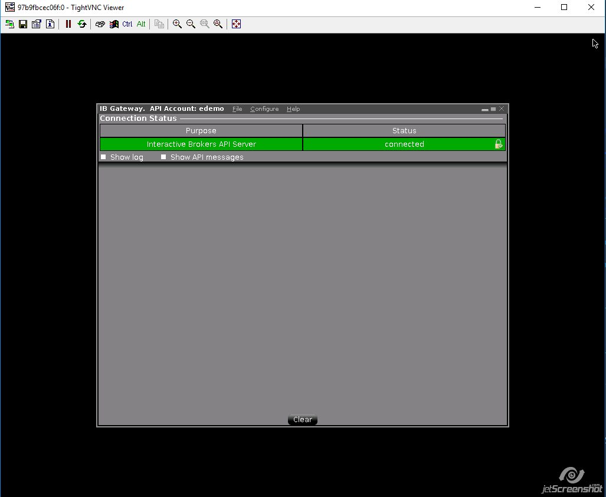

# Interactive Brokers Gateway Docker

IB Gateway running in Docker with [IB Controller](https://github.com/ib-controller/ib-controller/) and VNC

* TWS Gateway: v974.4g
* IB Controller: v3.2.0

### Docker Hub image

* https://hub.docker.com/r/mvberg/ib-gateway-docker

### Getting Started

```bash
> git clone
> cd ib-gateway-docker
> docker build .
> docker-compose up
```

#### Expected output

```bash
Creating ibgatewaydocker_tws_1 ...
Creating ibgatewaydocker_tws_1 ... done
Attaching to ibgatewaydocker_tws_1
tws_1  | Starting virtual X frame buffer: Xvfb.
tws_1  | find: '/opt/IBController/Logs': No such file or directory
tws_1  | stored passwd in file: /.vnc/passwd
tws_1  | Starting x11vnc.
tws_1  |
tws_1  | +==============================================================================
tws_1  | +
tws_1  | + IBController version 3.2.0
tws_1  | +
tws_1  | + Running GATEWAY 960
tws_1  | +
tws_1  | + Diagnostic information is logged in:
tws_1  | +
tws_1  | + /opt/IBController/Logs/ibc-3.2.0_GATEWAY-960_Tuesday.txt
tws_1  | +
tws_1  | +
tws_1  | Forking :::4001 onto 0.0.0.0:4003\n
```

You will now have the IB Gateway app running on port 4003 and VNC on 5901.

See [docker-compose.yml](docker-compose.yml) for configuring VNC password, accounts and trading mode.

Please do not open your box to the internet.

### Testing VNC

* localhost:5901



### Demo Accounts

It seems that all of the `demo` accounts are dead for good:

* edemo
* fdemo
* pmdemo

### Troubleshooting

Sometimes, when running in non-daemon mode, you will see this:

```java
Exception in thread "main" java.awt.AWTError: Can't connect to X11 window server using ':0' as the value of the DISPLAY variable.
```

You will have to remove the container `docker rm container_id` and run `docker-compose up` again.
